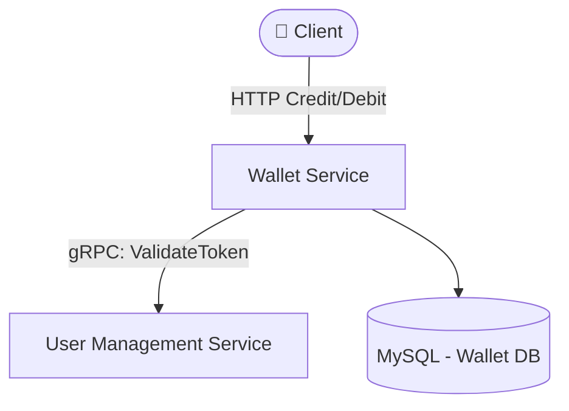

# Wallet Service - E-Wallet


Backend service for handling wallet balance mutations (Credit/Debit), wallet creation, and transaction history in the E-Wallet application.

## 🏗️ System Architecture & Data Flow

This service acts as the financial engine. It receives HTTP mutation requests from clients, verifies their authenticity by calling UMS via gRPC, and logs balance audits.



## 🛠️ Tech Stack

- **Language:** Go 1.25+
- **HTTP Router:** [Gin](https://github.com/gin-gonic/gin)
- **gRPC Client:** Connected to UMS for token verification
- **Database ORM:** [GORM](https://gorm.io/)
- **Database Engine:** MySQL (Pessimistic Locking `FOR UPDATE`)
- **Configuration:** [Koanf](https://github.com/knadh/koanf)
- **Logging:** [Zap](https://github.com/uber-go/zap)

---

## 📈 Wallet Service Progress Tracker

### ✅ Yang Sudah Dibuat (Done)

- [x] Inisialisasi Project dari `ewallet-framework`
- [x] Konfigurasi Port & Environment terpisah dari UMS
- [x] Integrasi structured logger (zap) & database connection pool
- [x] Health Check Endpoint (HTTP GET /health) dengan Ping DB MySQL
- [x] Migrasi Database (Tabel `wallets` & `wallet_transactions`)
- [x] Implementasi gRPC Client untuk integrasi dengan UMS

### 🎯 Target Selanjutnya (Up Next)

- [ ] API Create Wallet (di-trigger HTTP dari UMS post-register)
- [ ] API Credit Balance (Mutasi masuk & Idempotency check)
- [ ] API Debit Balance (Mutasi keluar, Saldo check, & Pessimistic Locking)
- [ ] API Get Balance & Wallet History (Mutasi history dengan pagination)

---

## 🚀 Port & Endpoint Reference

- **HTTP Server (Router: Gin):** `http://localhost:8081`
  - `POST /wallet/v1/` - Inisialisasi Wallet Baru
  - `PUT /wallet/v1/balance/credit` - Pengisian Saldo (Credit)
  - `PUT /wallet/v1/balance/debit` - Penarikan/Pembayaran Saldo (Debit)
  - `GET /wallet/v1/balance` - Cek Saldo Terkini
  - `GET /wallet/v1/history` - History Transaksi Dompet
  - `GET /health` - Liveness & Database Ping
- **gRPC Server:** `localhost:9091` (reserved)

---

## 💻 Cara Menjalankan Aplikasi Lokal

1. Pastikan Docker Desktop menyala di lokal kamu.
2. Database berjalan di engine MySQL yang sama di port 3306 (di-boot dari docker-compose UMS).
3. Buat database baru bernama `ewallet_wallet` via DB GUI/terminal.
4. Copy file `.env.example` ke `.env` (isi dengan kredensial databasemu).
5. Jalankan aplikasi menggunakan `air` (untuk hot-reload) atau:
   ```bash
   go run cmd/api/*.go
   ```
